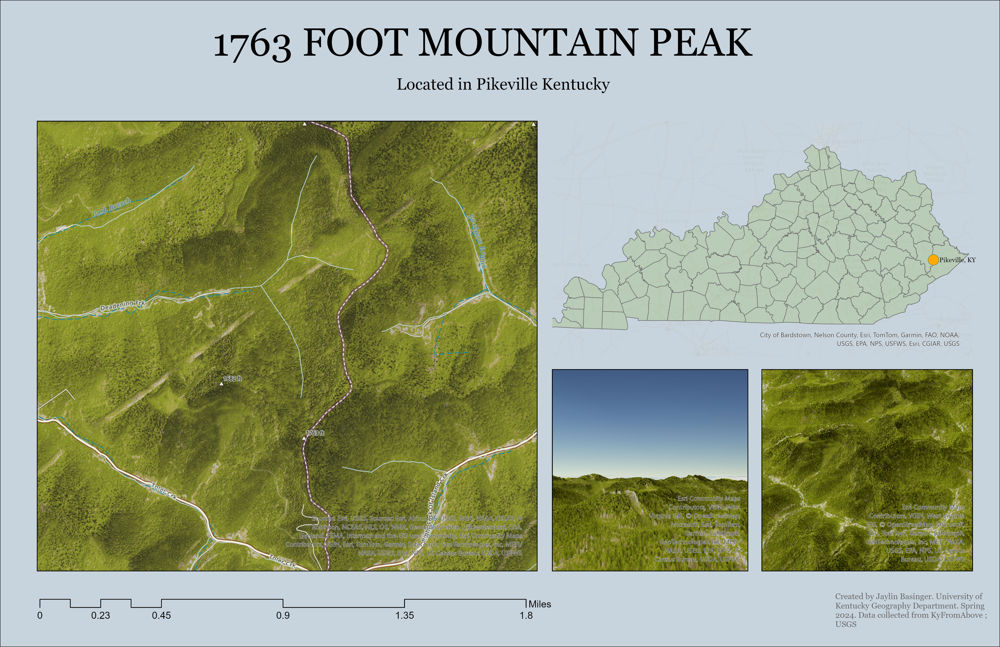

# Pikeville Mountain Peak
Map of mountains in Pikeville Kentucky, focued on a 1763 foot mountain peak just west of the center of Piikeville. 

     
*Both 2D and 3D displays of the mountain peak*

[Link to high-resolution version](highResolution.pdf)     

Compiled by Jaylin Basinger through the University of Kentucky's Geography department in Spring 2024. Data compiled from KyFromAbove and USGS
